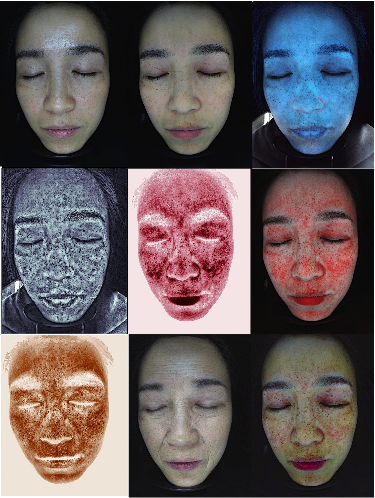

# OpenFaceSkinAnalyzer
<<<<<<< HEAD
开源四光谱皮肤检测算法，行业内最先进的皮肤检测仪分析算法，包含影像增强，可生成红区影像，棕区影像，近红外影像，真皮层影像，黑白影像等，可以对症状进行定量定性分析，还可以智能测脸，眼眉分析，模拟整形以及预测衰老和年轻。定量分析为真实单位而非像素单位。

Open-source multispectral skin detection algorithm, the most advanced skin detection analysis algorithm in the industry, includes image enhancement, capable of generating red zone images, brown zone images, near-infrared images, dermal layer images, grayscale images, etc. It can perform quantitative and qualitative analysis of symptoms, as well as intelligent face measurement, eyebrow analysis, simulation of plastic surgery, and prediction of aging and rejuvenation. Quantitative analysis is in real units rather than pixel units.

=======
开源四光谱皮肤检测算法，行业内最先进的皮肤检测仪分析算法，包含影像增强，可生成红区影像，棕区影像，近红外影像，真皮层影像，黑白影像等，可以对症状进行定量定性分析，还可以智能测脸，眼眉分析，模拟整形以及预测衰老和年轻。定量分析为真实单位而非像素单位。wechat：18503065305/17610195566

>>>>>>> f8415a6397d2b03fa64700e6ca4692c2bfdf4ec1
